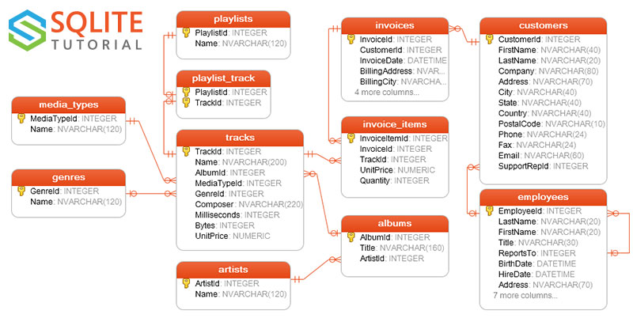

# SQLite Demos

This is a demo of using SQL commands using SQLite.

This uses the SQL database from tutorial on:
https://www.sqlitetutorial.net/sqlite-sample-database/

See demos.

---

## Demos

- [Select](#select)
- [Inner Join](#inner-join)
- [Full Outer Join](#full-outer-join)
- [Left Outer Join](#left-outer-join)
- [Union](#union)
- [Cross Join](#cross-join)
- [Many to many](#many-to-many)
- [Self join](#self-join)

---

## Database

> sample.db

## Relationships



Source: https://www.sqlitetutorial.net/sqlite-sample-database/

## Tables

sqlite> .tables
albums          employees       invoices        playlists     
artists         genres          media_types     tracks        
customers       invoice_items   playlist_track

---

### Select

*When to use*

Select allows us to return records from one, or multiple tables.

*Business case*

> "Show me 10 albums"

#### SQL

```
SELECT *
FROM albums
LIMIT 10
``` 

#### Results

```
1|For Those About To Rock We Salute You|1
2|Balls to the Wall|2
3|Restless and Wild|2
4|Let There Be Rock|1
...
```

---

### Inner Join

*When to use*

Use INNER JOIN when you want only the results that appear in both tables that matches the join condition.
The INNER JOIN keyword selects records that have matching values in both tables.

*Business case*

> "Show me all customers who have made purchases, along with their invoice details - so that I may review our active customer base and their spending patterns for our quarterly sales report."

- Shows customers who have actually made purchases (active customers)
- Ignores customers who registered but never bought anything
- Provides simplified invoice info for simple sales analysis


#### SQL

```
SELECT 
    c.CustomerId,
    c.FirstName,
    c.LastName,
    c.Email,
    c.Country,
    i.InvoiceId,
    i.InvoiceDate,
    i.BillingCity,
    i.Total as InvoiceTotal
FROM customers AS c
INNER JOIN invoices i ON c.CustomerId = i.CustomerId
ORDER BY c.LastName, c.FirstName, i.InvoiceDate DESC
LIMIT 25;
```

#### Results

```
12|Roberto|Almeida|roberto.almeida@riotur.gov.br|Brazil|395|2013-10-05 00:00:00|Rio de Janeiro|5.94
12|Roberto|Almeida|roberto.almeida@riotur.gov.br|Brazil|373|2013-07-03 00:00:00|Rio de Janeiro|3.96
12|Roberto|Almeida|roberto.almeida@riotur.gov.br|Brazil|350|2013-03-31 00:00:00|Rio de Janeiro|1.98
...
28|Julia|Barnett|jubarnett@gmail.com|USA|363|2013-05-19 00:00:00|Salt Lake City|0.99
28|Julia|Barnett|jubarnett@gmail.com|USA|311|2012-09-28 00:00:00|Salt Lake City|11.94
28|Julia|Barnett|jubarnett@gmail.com|USA|289|2012-06-26 00:00:00|Salt Lake City|3.96
...
39|Camille|Bernard|camille.bernard@yahoo.fr|France|389|2013-09-07 00:00:00|Paris|8.91
39|Camille|Bernard|camille.bernard@yahoo.fr|France|334|2013-01-07 00:00:00|Paris|13.86
39|Camille|Bernard|camille.bernard@yahoo.fr|France|323|2012-11-27 00:00:00|Paris|1.98
...
18|Michelle|Brooks|michelleb@aol.com|USA|396|2013-10-08 00:00:00|New York|8.91
18|Michelle|Brooks|michelleb@aol.com|USA|341|2013-02-07 00:00:00|New York|13.86
18|Michelle|Brooks|michelleb@aol.com|USA|330|2012-12-28 00:00:00|New York|1.98
```

---

### Full Outer Join

*When to use*

Use FULL OUTER JOIN when you need all records from both tables, regardless of whether they have matching records in the other table.

*Business case*

> "Show me all customers and all invoices to identify both customers without purchases and any orphaned invoices for our database cleanup project."

#### SQL

SELECT 
    c.CustomerId,
    c.FirstName,
    c.LastName,
    c.Email,
    i.InvoiceId,
    i.InvoiceDate,
    i.Total
FROM customers c
FULL OUTER JOIN invoices i ON c.CustomerId = i.CustomerId
ORDER BY c.LastName, i.InvoiceDate
LIMIT 10;

### Result

```
12|Roberto|Almeida|roberto.almeida@riotur.gov.br|34|2009-05-23 00:00:00|0.99
12|Roberto|Almeida|roberto.almeida@riotur.gov.br|155|2010-11-14 00:00:00|1.98
12|Roberto|Almeida|roberto.almeida@riotur.gov.br|166|2010-12-25 00:00:00|13.86
12|Roberto|Almeida|roberto.almeida@riotur.gov.br|221|2011-08-25 00:00:00|8.91
12|Roberto|Almeida|roberto.almeida@riotur.gov.br|350|2013-03-31 00:00:00|1.98
...
```

---

### Left Outer Join

*When to use*

Use LEFT OUTER JOIN when you need all records from the left table, even if there are no matching records in the right table.


*Business Case*

> "Show me all customers and their purchase totals, including customers who haven't made any purchases yet"

```
SELECT 
    c.CustomerId,
    c.FirstName,
    c.LastName,
    c.Email,
    COUNT(i.InvoiceId) as TotalPurchases,
    COALESCE(SUM(i.Total), 0) as TotalSpent
FROM customers c
LEFT OUTER JOIN invoices i ON c.CustomerId = i.CustomerId
GROUP BY c.CustomerId, c.FirstName, c.LastName, c.Email
ORDER BY TotalSpent DESC;
```

#### Results

```
6|Helena|Holý|hholy@gmail.com|7|49.62
26|Richard|Cunningham|ricunningham@hotmail.com|7|47.62
57|Luis|Rojas|luisrojas@yahoo.cl|7|46.62
45|Ladislav|Kovács|ladislav_kovacs@apple.hu|7|45.62
46|Hugh|O'Reilly|hughoreilly@apple.ie|7|45.62
24|Frank|Ralston|fralston@gmail.com|7|43.62
28|Julia|Barnett|jubarnett@gmail.com|7|43.62
37|Fynn|Zimmermann|fzimmermann@yahoo.de|7|43.62
...
```

---

### Union

*When to use*

Use UNION when you need to combine results from two or more similar tables or queries into one result set.

*Business Case*

> "Combine our customer email list with our employee email list to create a single mailing list for a new company newsletter."

```
SELECT 
    FirstName,
    LastName,
    Email,
    'Customer' as ContactType
FROM customers
WHERE Email IS NOT NULL

UNION

SELECT 
    FirstName,
    LastName,
    Email,
    'Employee' as ContactType
FROM employees
WHERE Email IS NOT NULL
ORDER BY LastName, FirstName;
```

#### Results

```
Andrew|Adams|andrew@chinookcorp.com|Employee
Roberto|Almeida|roberto.almeida@riotur.gov.br|Customer
Julia|Barnett|jubarnett@gmail.com|Customer
Camille|Bernard|camille.bernard@yahoo.fr|Customer
Michelle|Brooks|michelleb@aol.com|Customer
Robert|Brown|robbrown@shaw.ca|Customer
Laura|Callahan|laura@chinookcorp.com|Employee
...
```

---

### Cross Join

*When to use*

Use CROSS JOIN when you need every possible combination of records from two tables.

*Business ase*

> "Generate all possible combinations of genres and media types to plan our catalogue expansion strategy."

```
SELECT 
    g.Name as GenreName,
    mt.Name as MediaTypeName,
    g.Name || ' - ' || mt.Name as CombinationName
FROM genres g
CROSS JOIN media_types mt
ORDER BY g.Name, mt.Name
LIMIT 10;
```

#### Results

```
Alternative|AAC audio file|Alternative - AAC audio file
Alternative|MPEG audio file|Alternative - MPEG audio file
Alternative|Protected AAC audio file|Alternative - Protected AAC audio file
Alternative|Protected MPEG-4 video file|Alternative - Protected MPEG-4 video file
...
```

---

#### Many to many

*When to use*

We use joins to junction tables with many-to-many relationships, where records may have multiple associations/

*Business case*

> "Show me all playlists with their track details to analyse which songs appear in multiple playlists for our recommendation engine."

```
SELECT 
    p.Name as PlaylistName,
    t.Name as TrackName,
    ar.Name as ArtistName,
    al.Title as AlbumTitle,
    t.UnitPrice
FROM playlists p
INNER JOIN playlist_track pt ON p.PlaylistId = pt.PlaylistId
INNER JOIN tracks t ON pt.TrackId = t.TrackId
INNER JOIN albums al ON t.AlbumId = al.AlbumId
INNER JOIN artists ar ON al.ArtistId = ar.ArtistId
ORDER BY p.Name, ar.Name, t.Name
LIMIT 10;
```

#### Result

```
90’s Music|Fantasia On Greensleeves|Academy of St. Martin in the Fields & Sir Neville Marriner|The World of Classical Favourites|0.99
90’s Music|Solomon HWV 67: The Arrival of the Queen of Sheba|Academy of St. Martin in the Fields & Sir Neville Marriner|The World of Classical Favourites|0.99
90’s Music|Suite No. 3 in D, BWV 1068: III. Gavotte I & II|Academy of St. Martin in the Fields, Sir Neville Marriner & Thurston Dart|Bach: Orchestral Suites Nos. 1 - 4|0.99
```

---

### Self join

*Business case*

> "Show me all employees and their direct managers to create an organisational chart for HR."

*When to use*

Use SELF JOIN when you need to compare records within the same table or show hierarchical relationships.

#### SQL 

```
SELECT 
    e.EmployeeId,
    e.FirstName || ' ' || e.LastName as EmployeeName,
    e.Title as EmployeeTitle,
    m.FirstName || ' ' || m.LastName as ManagerName,
    m.Title as ManagerTitle
FROM employees e
LEFT JOIN employees m ON e.ReportsTo = m.EmployeeId
ORDER BY m.LastName, e.LastName
LIMIT 10;
```

#### Results

```
1|Andrew Adams|General Manager||
2|Nancy Edwards|Sales Manager|Andrew Adams|General Manager
6|Michael Mitchell|IT Manager|Andrew Adams|General Manager
5|Steve Johnson|Sales Support Agent|Nancy Edwards|Sales Manager
4|Margaret Park|Sales Support Agent|Nancy Edwards|Sales Manager
3|Jane Peacock|Sales Support Agent|Nancy Edwards|Sales Manager
8|Laura Callahan|IT Staff|Michael Mitchell|IT Manager
7|Robert King|IT Staff|Michael Mitchell|IT Manager
```

